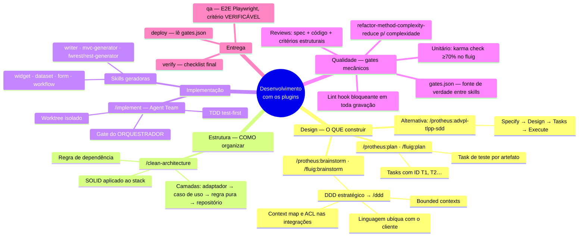
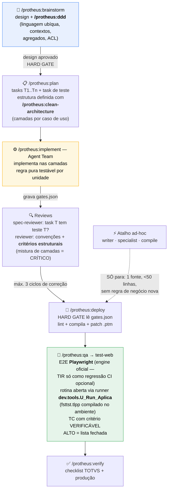
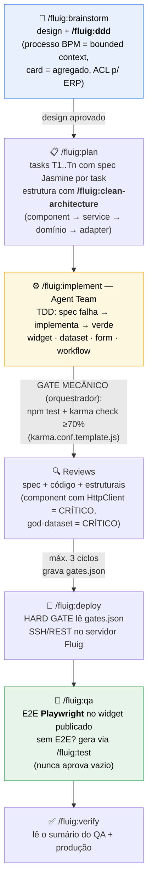

# Fluxo de trabalho — Protheus e Fluig

> Mapa visual de **como o dev deve trabalhar** com os plugins, onde cada gate acontece
> e **onde `/clean-architecture` e `/ddd` entram**. Os diagramas são Mermaid — o GitHub
> renderiza nativamente.

## Visão geral (mapa mental)

## Protheus — pipeline completo

**Onde cada skill de arquitetura entra:**

| Momento | Skill | O que ela responde |
|---|---|---|
| Brainstorm (antes de codar) | **`/protheus:ddd`** | *O que* construir: glossário com o key-user, 1 contexto = 1 namespace, invariantes de agregado (alinhado ao ExecAuto), ACL nas integrações |
| Plan/Implement | **`/protheus:clean-architecture`** | *Como* organizar: endpoint/PE fino → caso de uso → regra pura (testável por unidade, sem banco) → repositório (BeginSQL/ExecAuto) |
| Review | Ambas | Checklists estruturais dos reviewers apontam para as `references/` das duas skills; `/protheus:refactor-method-complexity-reduce` automatiza a extração de métodos |
| Legado | `/protheus:migrate` | Procedural → TLPP OO com SRP/Repository (usa os dois guias) |

## Fluig — pipeline completo

**Onde cada skill de arquitetura entra:**

| Momento | Skill | O que ela responde |
|---|---|---|
| Brainstorm | **`/fluig:ddd`** | Linguagem ubíqua materializada no diagrama BPM/formulário; documento do processo como agregado (client valida UX, **evento server é a autoridade**); falha de integração modelada |
| Plan/Implement | **`/fluig:clean-architecture`** | Widget em camadas (DI do Angular = DIP; componente nunca injeta HttpClient); dataset/evento como adaptador fino com regra pura separada |
| Review | Ambas | Categoria estrutural dos reviewers referencia as `references/` das skills |

## Os gates em uma linha cada

| Gate | Mecanismo | Quem garante |
|---|---|---|
| Lint em toda gravação | hook PostToolUse (`exit 2` bloqueia) | máquina |
| Unitário (fluig) | karma `check ≥70%` — `npm test` falha sozinho | máquina (orquestrador re-executa) |
| Reviews (spec + código) | teto de 3 ciclos, critérios estruturais | agente sonnet |
| Estado entre skills | `docs/plans/<plan>.gates.json` | arquivo (fonte de verdade) |
| E2E | Playwright com critério VERIFICÁVEL por TC | máquina + evidência |

> **Regra de ouro:** DDD decide *o que* construir (modelo do negócio), Clean Architecture
> decide *como* organizá-lo (camadas testáveis) — e os gates garantem que o que passou
> foi **provado**, não afirmado.
