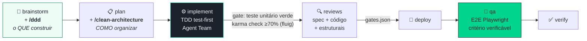
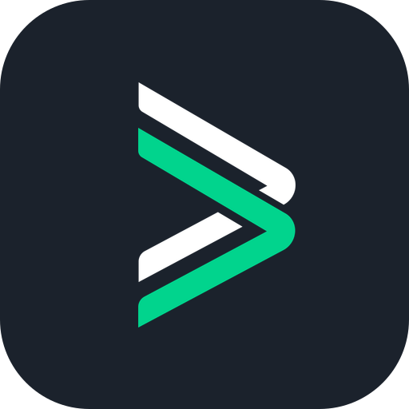

<div align="center">

<picture>
  <source media="(prefers-color-scheme: dark)" srcset="assets/brand/wordmark-on-dark.svg">
  
</picture>

<br/><br/>

**AGENT KIT**

[](https://github.com/tbc-servicos/dataagile-agent-kit/releases)
[](https://claude.ai/code)
[](./INSTALL.md)
[](https://dataagile-agent-kit.dataagile.com.br)
[](https://dataagile-agent-kit.dataagile.com.br)
[](./LICENSE)

### Protheus e Fluig dentro do Claude Code, Codex CLI e Gemini CLI.

*Base técnica curada · ciclo de desenvolvimento com Agent Team · compilação no AppServer · E2E com Playwright*

<br/>

[**Começar 7 dias grátis →**](https://dataagile-agent-kit.dataagile.com.br) &nbsp;&nbsp;·&nbsp;&nbsp; [Instalação](./INSTALL.md) &nbsp;&nbsp;·&nbsp;&nbsp; [dev@dataagile.com.br](mailto:dev@dataagile.com.br)

</div>

## Como trabalhar (o fluxo em 30 segundos)



- **`/ddd`** entra no *brainstorm*: linguagem ubíqua com o cliente, bounded contexts, agregados, ACL nas integrações — decide **o que** construir.
- **`/clean-architecture`** entra no *plan/implement*: adaptador fino → caso de uso → regra pura (testável sem banco) → repositório — decide **como** organizar.
- Os **gates são mecânicos** (lint bloqueante, teste unitário verde, `gates.json` entre etapas, QA com critério verificável) — o que passou foi *provado*, não afirmado.
- Mudança trivial (1 fonte, <50 linhas, sem regra nova)? Atalho `writer → compile`. Fora disso, pipeline completo.

🗺️ **Diagramas completos por plugin** (Protheus e Fluig, com todos os gates): [FLUXO-DE-TRABALHO.md](./FLUXO-DE-TRABALHO.md)


---

## O problema

Você abre o assistente de IA e pergunta sobre Protheus. Ele responde com segurança. Você cola no ambiente:

```
Function 'ExecBlock' not found at line 47.
```

Acontece porque o modelo não conhece as assinaturas reais, os pontos de entrada do seu módulo nem os parâmetros da sua versão do Protheus.

**O Agent Kit resolve isso.** O assistente passa a consultar a base técnica curada da DataAgile (funções ADVPL/TLPP, pontos de entrada, endpoints REST, SmartView e a documentação TDN) e cita a referência certa, com a assinatura correta. A cada edição, os hooks convertem o encoding para CP1252 e rodam o lint ADVPL e as regras de Code Analysis.

---

## Para quem é

| Perfil | O que ganha |
|--------|-------------|
| **Dev ADVPL/TLPP** | Desenho → plano → implementação com Agent Team → compilação no AppServer → E2E com Playwright → checklist TOTVS, tudo no terminal |
| **Dev Fluig** | Widgets Angular 19 + PO-UI 19.36, datasets, formulários e eventos de workflow no padrão da plataforma, com o mesmo ciclo |
| **Suporte técnico** | Diagnóstico de compilação, runtime, performance e lock de banco, com causa raiz, e consulta ao dicionário de dados |
| **Front com PO-UI** | MCP oficial do PO-UI: componentes Angular com inputs, outputs e exemplos corretos, sem abrir a documentação |

> No **Claude Code** você recebe os comandos, os hooks e o Agent Team. No **Codex CLI** e no **Gemini CLI**, a base de conhecimento e as skills sob demanda via MCP (`get_skill`). Detalhes no [INSTALL.md](./INSTALL.md).

---

## Instalação rápida

**Pré-requisito:** API key em [dataagile-agent-kit.dataagile.com.br](https://dataagile-agent-kit.dataagile.com.br)

```bash
npx github:tbc-servicos/dataagile-agent-kit
```

Funciona em **Claude Code**, **Codex CLI** e **Gemini CLI**. O instalador detecta o CLI instalado, pede a API key e configura tudo automaticamente — instala todos os plugins disponíveis (protheus, fluig, playwright, po-ui). Se algum passo falhar, exibe os comandos exatos para executar manualmente.

### Instalar via IA

Cole este prompt no **Claude Code**:

```
Execute os comandos abaixo para instalar o marketplace DataAgile e todos os plugins disponíveis globalmente:

claude plugin marketplace add https://github.com/tbc-servicos/dataagile-agent-kit.git
claude plugin install protheus@claude-skills-dataagile
claude plugin install fluig@claude-skills-dataagile
claude plugin install po-ui@claude-skills-dataagile
claude plugin install playwright@claude-skills-dataagile

Após cada comando, confirme se foi bem-sucedido. No final, rode "claude plugin list" e me mostre os plugins instalados.
```

Depois configure sua chave de API (substitua `SUA_CHAVE`):

```bash
mkdir -p ~/.config/dataagile && echo '{"api_key":"SUA_CHAVE"}' > ~/.config/dataagile/dev-config.json
```

> Guia completo por CLI, troubleshooting e desinstalação: [INSTALL.md](./INSTALL.md)

---

## Comandos

### Protheus: ciclo de desenvolvimento

```
/protheus:brainstorm  → perguntas, abordagens e desenho aprovado antes do código (Opus)
/protheus:plan        → tarefas tipadas e lista fechada de fontes
/protheus:implement   → Agent Team: implementer → spec-reviewer → reviewer (Sonnet)
/protheus:deploy      → compila no AppServer via TDS-CLI e gera o patch .ptm (Haiku)
/protheus:qa          → E2E com Playwright no ambiente compilado, com evidências
/protheus:verify      → checklist de conformidade TOTVS antes da produção
```

### Protheus: utilitários

```
/protheus:specialist            → consulta a base técnica: funções, PEs, endpoints, SmartView
/protheus:writer                → gera ADVPL/TLPP com notação húngara, MVC e ProtheusDoc
/protheus:reviewer              → revisão CRÍTICO / AVISO / SUGESTÃO
/protheus:code-review           → revisão com regras de Code Analysis e segurança
/protheus:diagnose              → compilação, runtime, performance e lock de banco
/protheus:data-dictionary-lookup → SX2, SX3, SIX, SX6, SX7 e demais tabelas do dicionário
/protheus:sql                   → SQL embarcado (BeginSQL/EndSQL, macros)
/protheus:mvc-generator         → ModelDef, ViewDef, MenuDef e BrowseDef
/protheus:tlpp-rest-endpoint-generator → endpoints REST em TLPP
/protheus:smartview-relatorio   → relatório TOTVS SmartView de ponta a ponta
/protheus:tir-test-generator    → scripts de teste TIR
/protheus:migrate               → ADVPL procedural → TLPP orientado a objetos
```

### Fluig

```
/fluig:brainstorm  → desenho aprovado, com integrações mapeadas, antes do scaffold
/fluig:plan        → arquivos mapeados e tarefas com testes
/fluig:widget      → widget Angular 19 + PO-UI 19.36 com testes Jasmine + Karma
/fluig:dataset     → dataset JavaScript com defineStructure/createDataset
/fluig:form        → formulário HTML com events/ e Util/
/fluig:workflow    → eventos BPM com tratamento de erro e log
/fluig:implement   → Agent Team: fluig-implementer → fluig-spec-reviewer → fluig-reviewer
/fluig:test        → unitários Jasmine + Karma e E2E com Playwright
/fluig:deploy      → deploy no servidor de teste com verificação de logs
/fluig:qa          → integração e E2E com Playwright após o deploy
/fluig:verify      → checklist final adaptado ao ambiente (HML ou servidor único)
/fluig:debug       → debugging em 4 fases
/fluig:api-ref     → DatasetFactory, CardAPI, WCMAPI, fluigc e demais APIs
```

> Compilação, deploy e QA precisam de um AppServer acessível e do TDS-CLI configurado (Protheus) ou de um servidor Fluig de teste com acesso configurado no seu projeto.

---

## MCP Servers incluídos

| Server | Função |
|--------|--------|
| `tbc-knowledge` | Base técnica remota: `searchFunction`, `searchKnowledge`, `findEndpoint`, `findSmartView`, `findMvcPattern`, `findExecAuto`, `searchByTable`, `listModules`, `searchDocuments`, `ragSearchDocs` e `ragSearchKnowledge` |
| `po-ui` | MCP oficial do PO-UI: componentes Angular, inputs, outputs e exemplos |

---

## Fluxo recomendado

```
/protheus:brainstorm      ←── Opus
        ↓
/protheus:plan
        ↓
/protheus:implement   ←── Agent Team (worktree isolado)
        ↓                  implementer (sonnet)
/protheus:deploy           spec-reviewer (sonnet)
        ↓                  reviewer (sonnet)
/protheus:qa          ←── deploy e compilação em haiku
        ↓
/protheus:verify
```

---

## Planos e privacidade

Plano Pro com 7 dias grátis e todos os plugins: [dataagile-agent-kit.dataagile.com.br](https://dataagile-agent-kit.dataagile.com.br). O que registramos de cada consulta e por quanto tempo está na [Política de Privacidade](https://dataagile-agent-kit.dataagile.com.br/privacy).

---

<div align="center">



**DataAgile**

[](https://dataagile-agent-kit.dataagile.com.br)
[](./INSTALL.md)
[](mailto:dev@dataagile.com.br)

</div>
